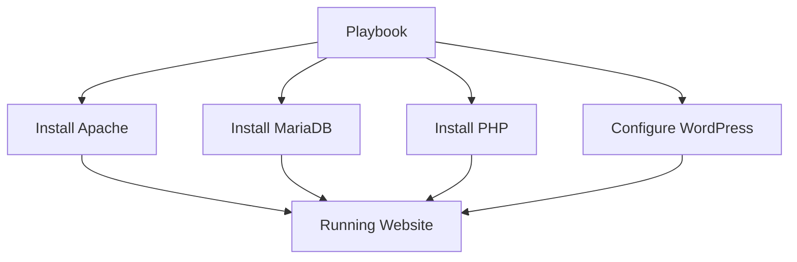

# WordPress Deployment with Ansible 🚀

## 📝 Overview
This Ansible project automates the deployment of a WordPress website on CentOS/RHEL servers. It sets up a complete LAMP stack (Linux, Apache, MariaDB, PHP) and configures WordPress with secure defaults.



## ✨ Features
- 🛡️ Secure MariaDB installation with root password protection  
- 🚀 Automatic WordPress download and configuration  
- 🔐 Database security with dedicated WordPress user  
- 🔄 Idempotent - safe to run multiple times  
- 📦 Modular role structure following Ansible best practices  

## 📦 Requirements

### Control Machine:
- Ansible 2.9+
- Python 3.6+

### Target Servers:
- CentOS/RHEL 7/8
- 2GB+ RAM (recommended)
- Python 3 with PyMySQL (`python3-PyMySQL`)

## 🛠️ Installation

Clone the repository:
```bash
git clone https://github.com/ahmedkhamees37/wordpress-ansible.git
cd wordpress-ansible
```


## ⚙️ Configuration

Edit these files before deployment:

### `inventory.ini` - Add your server details
```ini
[wordpress]
your.server.ip ansible_user=username ansible_ssh_private_key_file=~/.ssh/key.pem
```

### `group_vars/all.yml` - Set your credentials (use Ansible Vault for production!)
```yaml
db_root_password: "YourSecureRootPassword123!"
wp_db_password: "WordPressDBPassword456!"
```

## 🚀 Deployment

Run the playbook:
```bash
ansible-playbook -i inventory.ini playbook.yml
```

## 🔧 Customization Options

| Variable         | Default         | Description                     |
|------------------|------------------|---------------------------------|
| `wp_db_name`     | `wordpress`      | WordPress database name         |
| `wp_db_user`     | `wpuser`         | Database username               |
| `document_root`  | `/var/www/html`  | Web root directory              |
| `php_version`    | `8.2`            | PHP version to install          |

## 🛡️ Security Best Practices

- 🔒 Always use Ansible Vault for sensitive data  
- 🔄 Regularly update system packages  
- 📜 Configure firewall rules (included in playbook)  
- ✂️ Remove default test databases and anonymous users  

## 📊 Monitoring

The playbook includes optional tasks for:

- 📈 Prometheus monitoring setup  
- 📋 Logrotate configuration  
- 🔔 Email alerts for critical events  

## 🤝 Contributing

Pull requests are welcome! Please follow these steps:

1. Fork the repository  
2. Create your feature branch (`git checkout -b feature/AmazingFeature`)  
3. Commit your changes (`git commit -m 'Add some AmazingFeature'`)  
4. Push to the branch (`git push origin feature/AmazingFeature`)  
5. Open a Pull Request  

## 📜 License

This project is licensed under the MIT License - see the [LICENSE](LICENSE) file for details.

## 📬 Contact

For questions or support:

- 📧 Email: ahmedkhamees37@gmail.com  

- 💼 LinkedIn: https://www.linkedin.com/in/ahmed-khamis37/ 

---

**Made with ❤️ and Ansible magic! ✨**

